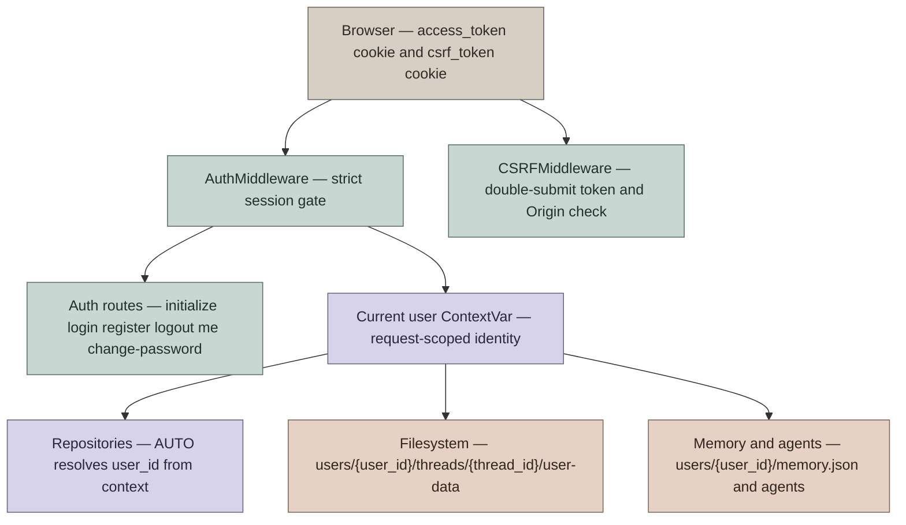

# 用户认证与隔离设计

本文档描述 DeerFlow 当前内置认证模块的设计，而不是历史 RFC。它覆盖浏览器登录、API 认证、CSRF、用户隔离、首次初始化、密码重置、内部调用和升级迁移。

## 设计目标

认证模块的核心目标是把 DeerFlow 从“本地单用户工具”提升为“可多用户部署的 agent runtime”，并让用户身份贯穿 HTTP API、LangGraph-compatible runtime、文件系统、memory、自定义 agent 和反馈数据。

设计约束：

- 默认强制认证：除健康检查、文档和 auth bootstrap 端点外，HTTP 路由都必须有有效 session。
- 服务端持有所有权：客户端 metadata 不能声明 `user_id` 或 `owner_id`。
- 隔离默认开启：repository（仓储）、文件路径、memory、agent 配置默认按当前用户解析。
- 旧数据可升级：无认证版本留下的 thread 可以在 admin 存在后迁移到 admin。
- 密码不进日志：首次初始化由操作者设置密码；`reset_admin` 只写 0600 凭据文件。

非目标：

- 当前用户角色只有 `admin` 和 `user`，尚未实现细粒度 RBAC。
- 当前登录限速是进程内字典，多 worker 下不是全局精确限速。

## 核心模型



### 用户表

用户记录定义在 `app.gateway.auth.models.User`，持久化到 `users` 表。关键字段：

| 字段 | 语义 |
|---|---|
| `id` | 用户主键，JWT `sub` 使用该值 |
| `email` | 唯一登录名 |
| `password_hash` | bcrypt hash，OAuth 用户可为空 |
| `system_role` | `admin` 或 `user` |
| `needs_setup` | reset 后要求用户完成邮箱 / 密码设置 |
| `token_version` | 改密码或 reset 时递增，用于废弃旧 JWT |

### 运行时身份

认证成功后，`AuthMiddleware` 把用户同时写入：

- `request.state.user`
- `request.state.auth`
- `deerflow.runtime.user_context` 的 `ContextVar`

`ContextVar` 是这里的核心边界。上层 Gateway 负责写入身份，下层 persistence / file path 只读取结构化的当前用户，不反向依赖 `app.gateway.auth` 具体类型。

可以把 repository 调用的用户参数理解成一个三态 ADT：

```scala
enum UserScope:
  case AutoFromContext
  case Explicit(userId: String)
  case BypassForMigration
```

对应 Python 实现是 `AUTO | str | None`：

- `AUTO`：从 `ContextVar` 解析当前用户；没有上下文则抛错。
- `str`：显式指定用户，主要用于测试或管理脚本。
- `None`：跳过用户过滤，只允许迁移脚本或 admin CLI 使用。

## 登录与初始化流程

### 首次初始化

首次启动时，如果没有 admin，服务不会自动创建账号，只记录日志提示访问 `/setup`。

流程：

1. 用户访问 `/setup`。
2. 前端调用 `GET /api/v1/auth/setup-status`。
3. 如果返回 `{"needs_setup": true}`，前端展示创建 admin 表单。
4. 表单提交 `POST /api/v1/auth/initialize`。
5. 服务端确认当前没有 admin，创建 `system_role="admin"`、`needs_setup=false` 的用户。
6. 服务端设置 `access_token` HttpOnly cookie，用户进入 workspace。

`/api/v1/auth/initialize` 只在没有 admin 时可用。并发初始化由数据库唯一约束兜底，失败方返回 409。

### 普通登录

`POST /api/v1/auth/login/local` 使用 `OAuth2PasswordRequestForm`：

- `username` 是邮箱。
- `password` 是密码。
- 成功后签发 JWT，放入 `access_token` HttpOnly cookie。
- 响应体只返回 `expires_in` 和 `needs_setup`，不返回 token。

登录失败会按客户端 IP 计数。IP 解析只在 TCP peer 属于 `AUTH_TRUSTED_PROXIES` 时信任 `X-Real-IP`，不使用 `X-Forwarded-For`。

### 注册

`POST /api/v1/auth/register` 创建普通 `user`，并自动登录。

当前实现允许在没有 admin 时注册普通用户，但 `setup-status` 仍会返回 `needs_setup=true`，因为 admin 仍不存在。这是当前产品策略边界：如果后续要求“必须先初始化 admin 才能注册普通用户”，需要在 `/register` 增加 admin-exists gate。

### 改密码与 reset setup

`POST /api/v1/auth/change-password` 需要当前密码和新密码：

- 校验当前密码。
- 更新 bcrypt hash。
- `token_version += 1`，使旧 JWT 立即失效。
- 重新签发 cookie。
- 如果 `needs_setup=true` 且传了 `new_email`，则更新邮箱并清除 `needs_setup`。

`python -m app.gateway.auth.reset_admin` 会：

- 找到 admin 或指定邮箱用户。
- 生成随机密码。
- 更新密码 hash。
- `token_version += 1`。
- 设置 `needs_setup=true`。
- 写入 `.deer-flow/admin_initial_credentials.txt`，权限 `0600`。

命令行只输出凭据文件路径，不输出明文密码。

## HTTP 认证边界

`AuthMiddleware` 是 fail-closed（默认拒绝）的全局认证门。

公开路径：

- `/health`
- `/docs`
- `/redoc`
- `/openapi.json`
- `/api/v1/auth/login/local`
- `/api/v1/auth/register`
- `/api/v1/auth/logout`
- `/api/v1/auth/setup-status`
- `/api/v1/auth/initialize`
- `/api/v1/auth/providers`
- `/api/v1/auth/oauth/` (所有子路径)
- `/api/v1/auth/callback/` (所有子路径)

其余路径都要求有效 `access_token` cookie。存在 cookie 但 JWT 无效、过期、用户不存在或 `token_version` 不匹配时，直接返回 401，而不是让请求穿透到业务路由。

路由级别的 owner check 由 `require_permission(..., owner_check=True)` 完成：

- 读类请求允许旧的未追踪 legacy thread 兼容读取。
- 写 / 删除类请求使用 `require_existing=True`，要求 thread row 存在且属于当前用户，避免删除后缺 row 导致其他用户误通过。

## CSRF 设计

DeerFlow 使用 Double Submit Cookie：

- 服务端设置 `csrf_token` cookie。
- 前端 state-changing 请求发送同值 `X-CSRF-Token` header。
- 服务端用 `secrets.compare_digest` 比较 cookie/header。

需要 CSRF 的方法：

- `POST`
- `PUT`
- `DELETE`
- `PATCH`

auth bootstrap 端点（login/register/initialize/logout）不要求 double-submit token，因为首次调用时浏览器还没有 token；但这些端点会校验 browser `Origin`，拒绝 hostile Origin，避免 login CSRF / session fixation。

## 用户隔离

### Thread metadata

Thread metadata 存在 `threads_meta`，关键隔离字段是 `user_id`。

创建 thread 时：

- 客户端传入的 `metadata.user_id` 和 `metadata.owner_id` 会被剥离。
- `ThreadMetaRepository.create(..., user_id=AUTO)` 从 `ContextVar` 解析真实用户。
- `/api/threads/search` 默认只返回当前用户的 thread。

读取 / 修改 / 删除时：

- `get()` 默认按当前用户过滤。
- `check_access()` 用于路由 owner check。
- 对其他用户的 thread 返回 404，避免泄露资源存在性。

### 文件系统

当前线程文件布局：

```text
{base_dir}/users/{user_id}/threads/{thread_id}/user-data/
├── workspace/
├── uploads/
└── outputs/
```

agent 在 sandbox 内看到统一虚拟路径：

```text
/mnt/user-data/workspace
/mnt/user-data/uploads
/mnt/user-data/outputs
```

`ThreadDataMiddleware` 使用 `get_effective_user_id()` 解析当前用户并生成线程路径。没有认证上下文时会落到 `default` 用户桶，主要用于内部调用、嵌入式 client 或无 HTTP 的本地执行路径。

### Memory

默认 memory 存储：

```text
{base_dir}/users/{user_id}/memory.json
{base_dir}/users/{user_id}/agents/{agent_name}/memory.json
```

有用户上下文时，空或相对 `memory.storage_path` 都使用上述 per-user 默认路径；只有绝对 `memory.storage_path` 会视为显式 opt-out（退出） per-user isolation，所有用户共享该路径。无用户上下文的 legacy 路径仍会把相对 `storage_path` 解析到 `Paths.base_dir` 下。

### 自定义 agent

用户自定义 agent 写入：

```text
{base_dir}/users/{user_id}/agents/{agent_name}/
├── config.yaml
├── SOUL.md
└── memory.json
```

旧布局 `{base_dir}/agents/{agent_name}/` 只作为只读兼容回退。更新或删除旧共享 agent 会要求先运行迁移脚本。

## 内部调用与 IM 渠道

IM channel worker 不是浏览器用户，不持有浏览器 cookie。它们通过 Gateway 内部认证：

- 请求带 `X-DeerFlow-Internal-Token`。
- 同时带匹配的 CSRF cookie/header。
- 服务端识别为内部用户，`id="default"`、`system_role="internal"`。

这意味着 channel 产生的数据默认进入 `default` 用户桶。这个选择适合“平台级 bot 身份”，但不是“每个 IM 用户单独隔离”。如果后续要做到外部 IM 用户隔离，需要把外部 platform user 映射到 DeerFlow user，并让 channel manager 设置对应的 scoped identity。

## LangGraph-compatible 认证

Gateway 内嵌 runtime 路径由 `AuthMiddleware` 和 `CSRFMiddleware` 保护。

仓库仍保留 `app.gateway.langgraph_auth`，用于 LangGraph Server 直连模式：

- `@auth.authenticate` 校验 JWT cookie、CSRF、用户存在性和 `token_version`。
- `@auth.on` 在写入 metadata 时注入 `user_id`，并在读路径返回 `{"user_id": current_user}` 过滤条件。

这保证 Gateway 路由和 LangGraph-compatible 直连模式使用同一 JWT 语义。

## 升级与迁移

从无认证版本升级时，可能存在没有 `user_id` 的历史 thread。

当前策略：

1. 首次启动如果没有 admin，只提示访问 `/setup`，不迁移。
2. 操作者创建 admin。
3. 后续启动时，`_ensure_admin_user()` 找到 admin，并把 LangGraph store 中缺少 `metadata.user_id` 的 thread 迁移到 admin。

文件系统旧布局迁移由脚本处理：

```bash
cd backend
PYTHONPATH=. python scripts/migrate_user_isolation.py --dry-run
PYTHONPATH=. python scripts/migrate_user_isolation.py --user-id <target-user-id>
```

迁移脚本覆盖 legacy `memory.json`、`threads/` 和 `agents/` 到 per-user layout。

## 安全不变量

必须长期保持的不变量：

- JWT 只在 HttpOnly cookie 中传输，不出现在响应 JSON。
- 任何非 public HTTP 路由都不能只靠“cookie 存在”放行，必须严格验证 JWT。
- `token_version` 不匹配必须拒绝，保证改密码 / reset 后旧 session 失效。
- 客户端 metadata 中的 `user_id` / `owner_id` 必须剥离。
- repository 默认 `AUTO` 必须从当前用户上下文解析，不能静默退化成全局查询。
- 只有迁移脚本和 admin CLI 可以显式传 `user_id=None` 绕过隔离。
- 本地文件路径必须通过 `Paths` 和 sandbox path validation 解析，不能拼接未校验的用户输入。
- 捕获认证、迁移、后台任务异常必须记录日志；不能空 catch。

## 已知边界

| 边界 | 当前行为 | 后续方向 |
|---|---|---|
| 无 admin 时注册普通用户 | 允许注册普通 `user` | 如产品要求先初始化 admin，给 `/register` 加 gate |
| 登录限速 | 进程内 dict，单 worker 精确，多 worker 近似 | Redis / DB-backed rate limiter |
| OAuth / OIDC | 已实现通用 OIDC SSO（Keycloak, Google, Azure AD, Okta 等），支持 PKCE + nonce、auto-provisioning、email domain 限制（详见 [SSO.md](SSO.md)） | 支持 RP-initiated logout、自定义 scope 映射 |
| IM 用户隔离 | channel 使用 `default` 内部用户 | 建立外部用户到 DeerFlow user 的映射 |
| 绝对 memory path | 显式共享 memory | UI / docs 明确提示 opt-out 风险 |

## 相关文件

| 文件 | 职责 |
|---|---|
| `app/gateway/auth_middleware.py` | 全局认证门、JWT 严格验证、写入 user context |
| `app/gateway/csrf_middleware.py` | CSRF double-submit 和 auth Origin 校验 |
| `app/gateway/routers/auth.py` | initialize/login/register/logout/me/change-password + SSO OIDC 端点（providers/oauth/callback） |
| `app/gateway/auth/jwt.py` | JWT 创建与解析 |
| `app/gateway/auth/oidc.py` | OIDC 核心服务：discovery、token exchange、ID token 验证、userinfo |
| `app/gateway/auth/oidc_state.py` | OIDC state 管理：signed cookie 存储 state/nonce/code_verifier |
| `app/gateway/auth/user_provisioning.py` | OIDC 用户自动创建、email linking、domain 限制 |
| `app/gateway/auth/models.py` | 用户数据模型（含 `oauth_provider` / `oauth_id`） |
| `packages/harness/deerflow/config/auth_config.py` | OIDC 配置模型（OIDCProviderConfig / OIDCAuthConfig） |
| `app/gateway/auth/reset_admin.py` | 密码 reset CLI |
| `app/gateway/auth/credential_file.py` | 0600 凭据文件写入 |
| `app/gateway/authz.py` | 路由权限与 owner check |
| `deerflow/runtime/user_context.py` | 当前用户 ContextVar 与 `AUTO` sentinel |
| `deerflow/persistence/thread_meta/` | thread metadata owner filter |
| `deerflow/config/paths.py` | per-user filesystem layout |
| `deerflow/agents/middlewares/thread_data_middleware.py` | run 时解析用户线程目录 |
| `deerflow/agents/memory/storage.py` | per-user memory storage |
| `deerflow/config/agents_config.py` | per-user custom agents |
| `app/channels/manager.py` | IM channel 内部认证调用 |
| `scripts/migrate_user_isolation.py` | legacy 数据迁移到 per-user layout |
| `.deer-flow/data/deerflow.db` | 统一 SQLite 数据库，包含 users / threads_meta / runs / feedback 等表 |
| `.deer-flow/users/{user_id}/agents/{agent_name}/` | 用户自定义 agent 配置、SOUL 和 agent memory |
| `.deer-flow/admin_initial_credentials.txt` | `reset_admin` 生成的新凭据文件（0600，读完应删除） |
